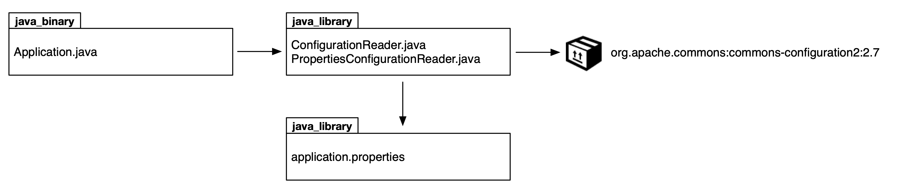

# Exercise 5

In this exercise, you will declare package dependencies and external Maven dependencies for a Java-based project. The class `com.bmuschko.app.config.PropertiesConfigurationReader` uses the external library [Apache Commons Configuration](https://commons.apache.org/proper/commons-configuration/) which needs to be defined as external dependency for the project.

The following image shows the high-level architecture.

Reference the documentation of the [java_binary rule](https://bazel.build/reference/be/java#java_binary) and [java_library rule](https://bazel.build/reference/be/java#java_library) for more information.

1. Inspect the existing source code files in the `start` directory.
2. Run the main class `com.bmuschko.app.Application` of the compiled program. Ensure that the error message indicates that the external dependency cannot be resolved.
3. Add the [rules_jvm_external](https://github.com/bazelbuild/rules_jvm_external) to the `WORKSPACE` file with the latest version. Declare the dependency `org.apache.commons:commons-configuration2:2.7` and the repository [Maven Central](https://repo1.maven.org/maven2). Reference the dependency in the package `src/main/java/com/bmuschko/app/config`.
4. Run the main class `com.bmuschko.app.Application` of the compiled program. What error message do you see? Discuss the root cause of the issue and a fix for it.
5. After fixing all the issues, run the program again. You should see the output of the program on the console.
